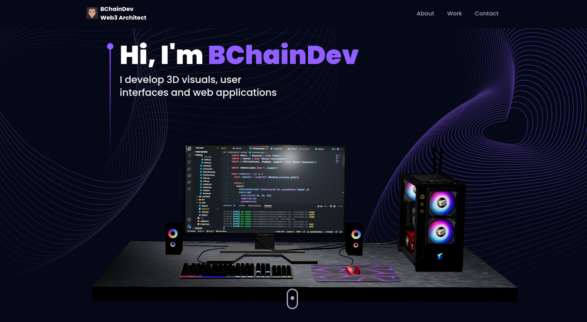

# BChainDev
This project utilizes 3D effects and gives the user a interactive page that is simple and fun.

## Screenshots:


## Built with:

React
Three.JS

## How to use?
First, run the development server:

```bash
npm run dev
```
Open LocalHost with your browser to see the result.

## Contribute:
Feel free to a fork the repo or notify me of any issues that are present

## Credit:

JavascriptMastery's tutorial helped me create this project:
https://www.youtube.com/watch?v=0fYi8SGA20k&t=9787s

## License:

MIT © BChainDev
